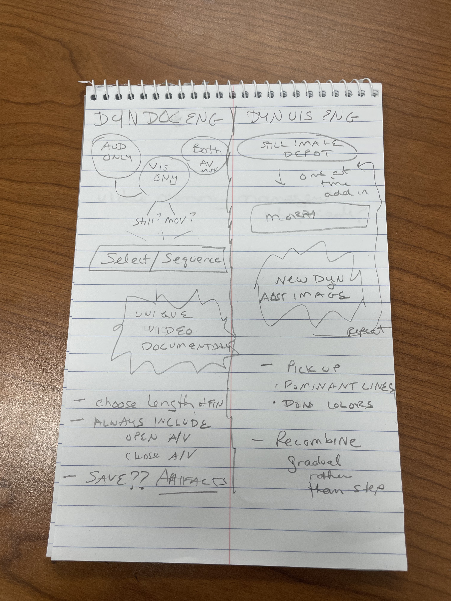
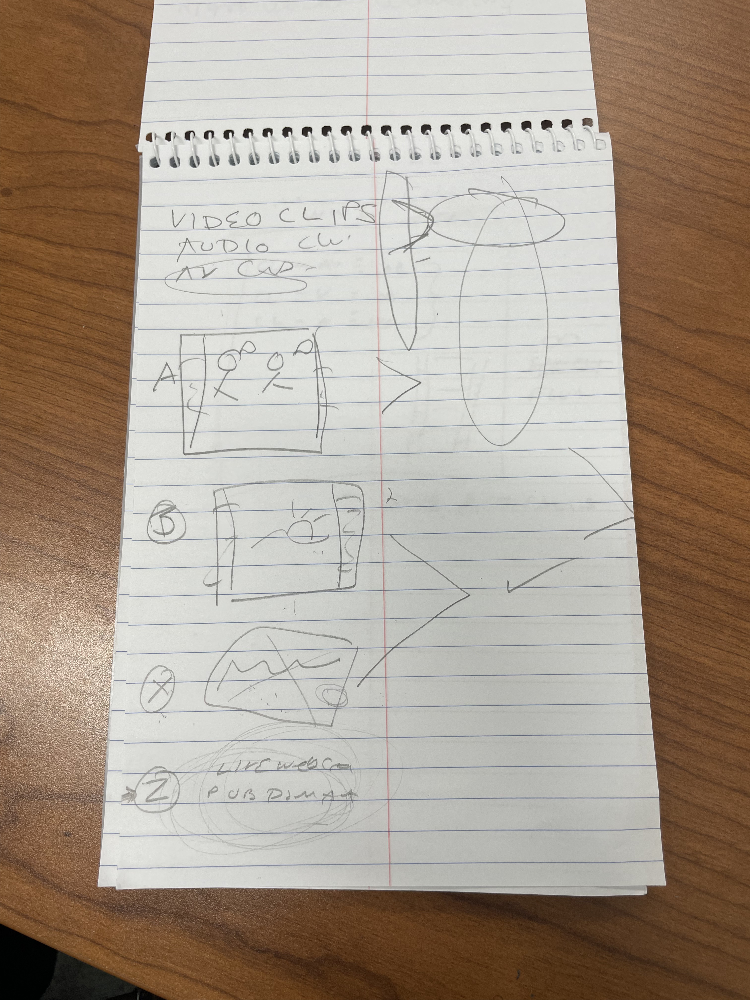
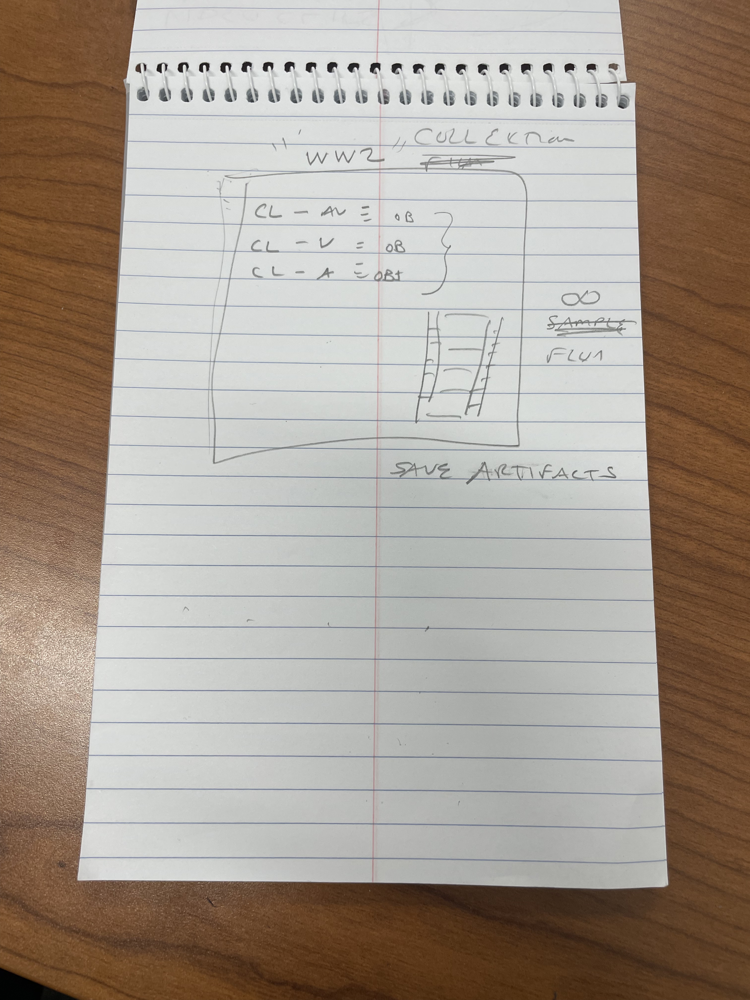

# Dynamic Documentary Engine

An AI-powered generative documentary engine that dynamically assembles films from a collection of modular media artifacts with no two screenings ever being the same.

**IST 495 Research Internship — Penn State University, College of IST**

**Student:** Oluwafemisola David Ademoye

**Supporting Student:** Omotola Ajibike Ajao

**Supervisor:** Dr. Betsy Campbell, Associate Teaching Professor, College of Information Sciences and Technology (IST).

---

### ▶ Running this on your own computer?

**Start here: [SETUP-GUIDE.md](SETUP-GUIDE.md)** — a step-by-step guide that
assumes no coding experience. Install two free programs once, then start the
engine by double-clicking a file.

---

## Overview

Inspired by the *Eno* documentary (2024) and its Brain One engine built by Brendan Dawes, this engine uses AI as a director by pulling from a curated collection of modular media artifacts and dynamically assembling them into a unique film on every run. No human curation happens at runtime. The engine decides.

All sequencing logic is creative code — selection decisions are driven entirely by metadata rules, dissimilarity (contrast) scoring between artifacts, artifact weights, and weighted random selection. No external AI services are used at runtime.

The project also explores whether modern AI tooling can replicate and extend the generative documentary approach — making it accessible, extensible, and applicable to new collections beyond a single film.

---

## How It Works

Each time the engine runs, it:

1. Reads a **collection** of tagged media **artifacts** (A-roll, B-roll, X-roll)
2. Accepts a target runtime, entered in seconds or minutes, to control film length
3. Selects and orders artifacts by **maximum dissimilarity** from the previous clip — contrast, not continuity
4. Opens and closes with a randomly generated B-roll + X-roll pair, so the bookends differ every run
5. Pairs B-roll artifacts with X-roll artifacts so every silent clip carries sound
6. Assembles the sequence into a rendered **film** via FFmpeg
7. Wraps the result in an opening and closing title piece
8. Saves the generated film, plus a manifest of every decision, for analytical review

### Selection criteria

Selection is driven by **contrast**, not emotional arc. The engine deliberately
applies no pacing-arc or mood-progression logic: each pick is the artifact most
dissimilar from what preceded it, across media type, colour, pacing, tags,
themes and geography. Cross-category collision is the intended effect.

Two optional modes adjust this:

- **Diversity mode** — boosts underused clips across runs, so high-contrast
  favourites don't dominate every film.
- **Exact duration** — trims the final render to match the requested length
  precisely. Off by default: whole clips are preserved at the cost of landing
  a few seconds short.

---

## Terminology

| Term | Definition |
|------|------------|
| **Collection** | The full curated set of media artifacts for a given project (e.g. a WW2 documentary collection) |
| **Artifact** | A single media module within a collection — an A-roll, B-roll, or X-roll clip |
| **Film** | The unique rendered output produced by the engine from a collection |

### Artifact Types

| Type | Description |
|------|-------------|
| **A-roll** | Main footage — synchronized audio and video. Stands alone. |
| **B-roll** | Supplemental video — no audio track. Always paired with an X-roll. |
| **X-roll** | Pure audio only — narration, ambient sound, music. Layered over B-roll. |

All artifacts are tagged with structured JSON metadata that drives the sequencing engine's decisions.

---
## Runtime Control

The engine accepts a `target_duration` in seconds; the web interface lets you
enter it in **seconds or minutes**, so a feature-length film can be requested
as "90 minutes" rather than "5400 seconds".

- Supports values from **1 second to 10 hours**
- Assembly is batched, so film length is not limited by the number of clips
- Rendering takes roughly **0.3× the film's own length** — a 90-second film in
  about 30 seconds, a feature-length film in about half an hour

**The real ceiling on length is footage, not code.** No artifact repeats within
a film, so a film can never run longer than the collection's total A-roll +
B-roll. A 90-minute film needs 90 minutes of source material.

---

## B-roll and X-roll Pairing

B-roll artifacts will carry video but no audio. Whenever the engine selects a B-roll artifact, it immediately pairs it with an X-roll artifact to provide the audio layer. The FFmpeg assembler overlays the two tracks during rendering. A-roll artifacts always stand alone as they carry synchronized audio and video.

---

## Collection Structure

Each film topic is a **self-contained folder** under `local-media/`. The engine
discovers any folder shaped this way automatically — adding a topic needs no
code changes and no settings:

```
local-media/
└── WWII/                      ← one film topic
    ├── assets/
    │   ├── a-roll/            ← synchronized audio + video
    │   ├── b-roll/            ← visual only, paired with X-roll
    │   └── x-roll/            ← audio only, layered under B-roll
    ├── titles/
    │   ├── opening/           ← this topic's own opening piece (optional)
    │   └── closing/           ← this topic's own closing piece (optional)
    └── artifacts/             ← rendered films + their manifests
```

Dropping a file into an `assets` subfolder is enough — it's auto-tagged
(duration, dominant colour, pacing) and enters rotation on the next run.
Deleting one retires it.

Every film is wrapped in an **opening and closing title piece**. Drop a video
into a topic's `titles/opening/` or `titles/closing/` and it becomes that
topic's own, at any length; leave the folder empty and a generated text card is
used. This is separate from the randomized B-roll + X-roll bookends *inside*
the sequence, which differ every run.

---

## Project Structure

```
dynamic-documentary-engine/
├── engine/                        # Python sequencing engine (creative code only)
│   ├── __init__.py                # Package entry point
│   ├── sequencer.py               # Main sequencing coordinator
│   ├── rules.py                   # No-repeat, duration budget, pairing rules
│   ├── artifact_selector.py       # Dissimilarity scoring and weighted selection
│   ├── collection_loader.py       # Collection index loader and validator
│   ├── assembler.py               # FFmpeg rendering — clip and audio assembly
│   └── cancellation.py            # Cooperative cancellation of a running render
├── scripts/
│   ├── dde_runtime.py             # Shared pipeline used by both the CLI and web
│   ├── run_first_film.py          # Command-line film generation
│   └── build_validation_collection.py
├── web/
│   ├── backend/app.py             # Flask API server
│   └── frontend/                  # Browser interface (plain HTML/CSS/JS)
│       ├── index.html/.css/.js    #   director's console
│       └── exhibit.html/.css/.js  #   gallery/kiosk view
├── local-media/<topic>/           # Per-topic footage, title pieces, rendered films
├── metadata/
│   ├── collections/               # Per-topic collection indexes
│   └── collection_index_schema.json
├── docs/                          # Research writing and design sketches
├── Start Engine (Mac).command     # Double-click launcher
├── Start Engine (Windows).bat     # Double-click launcher
├── SETUP-GUIDE.md                 # Beginner setup guide
└── README.md
```

---

## The Interface

Two views onto the same engine, for two different people.

### Director's console (`/`)

The working instrument. Choose a topic and target length, generate, and watch
the result with the reasoning exposed:

- **Sequence trace** — every cut, with the dissimilarity score and the
  dimensions that made the chosen clip the most contrasting option. This is
  the research artifact: it makes an otherwise invisible decision legible.
- **Film history** — every film generated, replayable and deletable.
- Diversity mode and exact duration toggles, a cancel button for a render in
  progress, and a light/dark theme.

### Exhibit view (`/exhibit`)

The gallery installation. Staff set the topic and length once; visitors see a
single button. Films play full screen and automatically, with a plain-language
progress readout while one is being built. Two modes: a visitor presses the
button, or it runs unattended all day, making a new film each time one
finishes.

Running it is a double-click — see **[SETUP-GUIDE.md](SETUP-GUIDE.md)**.

---

## Deliverables

- [x] Project architecture and meeting documentation
- [x] GitHub repository setup
- [x] Metadata schema (JSON) for A-roll, B-roll, and X-roll artifacts
- [x] Python sequencing engine — rule-based creative code
- [x] Sample collection (17 artifacts, self-recorded + public domain)
- [x] FFmpeg rendering pipeline
- [x] Web interface — director's console and gallery/exhibit view
- [x] Generated film artifacts saved for analytical review
- [x] Multi-topic collections, auto-discovered from the folder structure
- [x] Turnkey setup for a non-technical operator (guide + double-click launchers)
- [ ] Real WWII and Swiss footage loaded into their collections
- [ ] Exhibit hardware and installation at the gallery
- [ ] Technical documentation report targeting academic publication

---

## Technical Stack

- **Python** — sequencing engine and pipeline logic
- **FFmpeg** — video and audio assembly and rendering
- **Flask** — backend API
- **HTML / CSS / JavaScript** — frontend, with no framework and no build step

The frontend is deliberately dependency-free: the engine has to be handed to a
non-technical operator and run on a gallery machine, so there is nothing to
compile, install, or keep up to date beyond Python and FFmpeg.

---

## Inspiration

This project draws directly from the *Eno* documentary (2024), directed by Gary Hustwit, and the Brain One generative engine built by Brendan Dawes — a system that produces an algorithmically different cut of the film at every screening. This project asks: can that same generative approach be rebuilt with modern AI tooling and applied broadly to documentary collections?

---
## Research Context

This project builds directly on the generative documentary approach pioneered by Brain One. For a detailed comparative analysis of the two systems — including shared foundations, key technical differences, the authorship question, emotional arc modeling, and the open-world retrieval vision — see [docs/comparative_analysis_brain_one.md](docs/comparative_analysis_brain_one.md).

---

## Design Sketches

Early hand-drawn sketches documenting the system architecture and design thinking behind the project.

### System architecture — Dyn Doc Engine vs Dyn UIS Engine


### Artifact types — A-roll, B-roll, X-roll funnel


### Collection hierarchy — WW2 collection example


---

## Notes

- Generated films are saved as analytical artifacts — each with a JSON manifest
  recording the full sequence and the contrast reasoning behind every cut — for
  research and critical analysis of the selection process, not for public
  distribution.
- Source footage is **not** stored in this repository (`.gitignore` excludes
  video and audio). A clone provides the engine and the folder structure; the
  media is supplied separately.
- Hour tracking is maintained via Google Sheets.
- Regular check-ins are held with Dr. Campbell.
- Gallery submission planned, technology and art focused.
