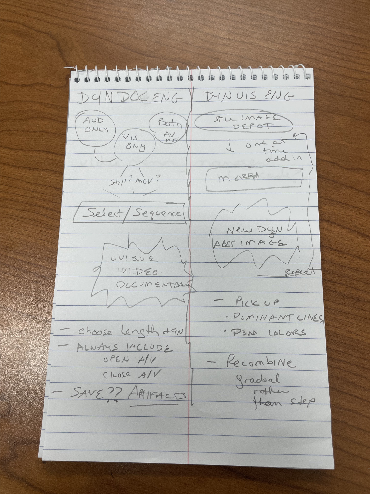
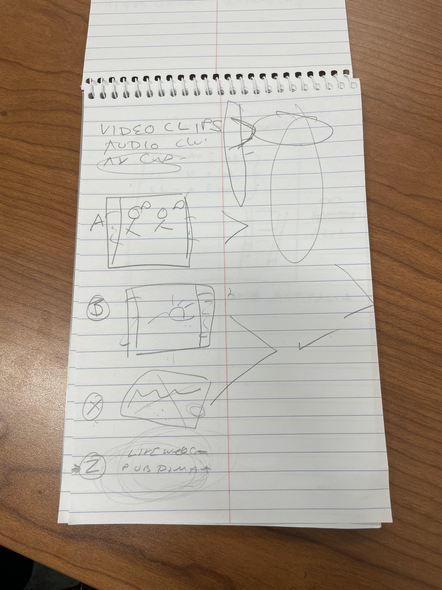
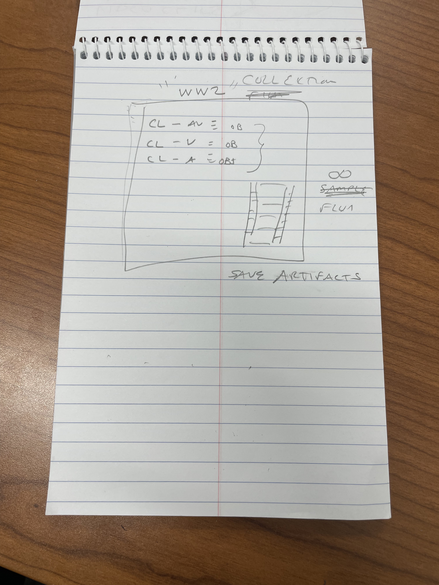

# Dynamic Documentary Engine

A generative documentary engine that assembles a **unique film on every run** from a collection of modular media clips — no two screenings are ever the same.

**IST 495 Research Internship — Penn State University, College of IST**
**Student:** Oluwafemisola David Ademoye · **Supervisor:** Dr. Betsy Campbell, Associate Teaching Professor

---

> ### ▶ Just want to run it?
> Two ways in:
> - **New to this / no coding experience?** Follow **[SETUP-GUIDE.md](SETUP-GUIDE.md)** — it installs the two free tools you need and starts the engine with a double-click.
> - **Comfortable in a terminal?** Use the **Quick Start** below.

---

## What it is

Give the engine a collection of tagged clips and a target length, and it assembles a unique, watchable film every time you run it. It orders the clips by **maximum contrast** — each cut is the clip *most unlike* the one before it, across type, colour, pacing, tags, theme and geography. Contrast, not continuity.

All of the sequencing is original **"creative code"** — metadata rules, a dissimilarity score, and weighted random selection. **No AI runs at generation time; the engine decides entirely by its own rules.** (The wider project *is* partly an exploration of building a system like this with AI-assisted "vibe coding" — but that's the development story, captured in the research write-up, not something the running engine does.)

Conceptually inspired by the **Brain One** engine (Brendan Dawes, from the 2024 *Eno* documentary), which produces a different cut of the film at every screening. Brain One is closed-source; this is an original, open rebuild of that idea.

---

## Try it yourself (Quick Start)

**Prerequisites:** Python 3 and FFmpeg installed. If you don't have them, [SETUP-GUIDE.md](SETUP-GUIDE.md) walks through it for Mac and Windows.

```bash
# 1. Get the code
git clone https://github.com/Dave-ASC1/dynamic-documentary-engine.git
cd dynamic-documentary-engine

# 2. Install the (tiny) Python dependencies
pip install -r requirements.txt          # flask, jsonschema

# 3. Start the engine
python3 web/backend/app.py               # or double-click "Start Engine (Mac).command" / "(Windows).bat"
```

Then open the URL it prints (usually **http://127.0.0.1:5001**) in your browser.

**To make your first film:**
1. Pick a **film topic** and a **target length** (seconds or minutes).
2. Hit **Generate** and watch the result play.
3. Try the controls: the **Audio transitions** dropdown (how the music eases across cuts), **Diversity mode**, and **Exact duration**.
4. Visit **`/exhibit`** for the single-button gallery/kiosk view.

**To actually put it through its paces:**
- Generate the same topic a few times — confirm no two films are alike.
- Open the **sequence trace** under a film to see *why* each cut was chosen (the contrast score and the dimensions behind it).
- Drop your own clips into a topic's `assets/` folders (see [Adding clips](#adding-your-own-clips)) and regenerate — they enter rotation with no code changes.

> **No footage yet?** Source video/audio isn't stored in this repo (it's gitignored). Add a few of your own clips (step above) to see the engine work on real media.

---

## How it works

Each run, the engine:

1. Reads a **collection** of tagged **artifacts** (A-roll, B-roll, X-roll).
2. Takes a target runtime (1 second to ~10 hours).
3. Opens and closes with a randomly generated **B-roll + X-roll** pair, so the bookends differ every run.
4. Fills the middle by repeatedly choosing the artifact **most dissimilar** from the previous one.
5. Pairs every B-roll (silent video) with an X-roll (audio) so nothing plays silent.
6. Renders the sequence into a finished film with **FFmpeg**, eases the audio across each cut, and wraps it in opening/closing title pieces.
7. Saves the film plus a **manifest** recording every decision, for later review.

Two optional modes: **Diversity mode** (boosts underused clips so favourites don't dominate) and **Exact duration** (trims the final render to the exact requested length; off by default so whole clips are preserved).

---

## Terminology

| Term | Meaning |
|------|---------|
| **Collection** (a.k.a. topic) | The full curated set of clips for a project (e.g. a WWII collection) |
| **Artifact** | A single clip within a collection |
| **Film** | A unique rendered output the engine produces from a collection |

| Artifact type | Description |
|------|-------------|
| **A-roll** | Synchronized audio + video. Stands alone. |
| **B-roll** | Video only, no audio. Always paired with an X-roll. |
| **X-roll** | Audio only (narration, ambience, music). Layered under a B-roll. |

Every artifact carries structured JSON metadata that drives the engine's decisions.

---

## Adding your own clips

Each film topic is a **self-contained folder** under `local-media/`. The engine auto-discovers any folder shaped this way — adding a topic needs no code and no settings:

```
local-media/
└── WWII/                      ← one film topic
    ├── assets/
    │   ├── a-roll/            ← synchronized audio + video
    │   ├── b-roll/            ← visual only, paired with X-roll
    │   └── x-roll/            ← audio only, layered under B-roll
    ├── titles/{opening,closing}/   ← this topic's own title pieces (optional)
    └── artifacts/             ← rendered films + their manifests
```

Drop a file into an `assets` subfolder and it's auto-tagged (duration, dominant colour, pacing) and enters rotation on the next run; delete one to retire it. Leave `titles/` empty and a generated text card is used instead.

---

## The interface

Two views onto the same engine:

- **Director's console (`/`)** — the working instrument: topic and length pickers, the generate/cancel controls, the audio/diversity/exact-duration options, the **sequence trace** (why each cut was chosen), and a replayable **film history** with the date and time each was made.
- **Exhibit view (`/exhibit`)** — the gallery installation: staff set topic and length once, visitors see a single button, films play full screen with a plain-language progress readout. Can also run unattended, making a new film whenever one finishes.

---

## Project structure

```
dynamic-documentary-engine/
├── engine/                     # Python sequencing engine (creative code only)
│   ├── sequencer.py            #   coordinates a run: bookends + body
│   ├── rules.py                #   no-repeat, duration budget, pairing
│   ├── artifact_selector.py    #   dissimilarity scoring + weighted selection
│   ├── collection_loader.py    #   loads/validates a collection index
│   ├── assembler.py            #   FFmpeg rendering, audio layering + fades
│   └── cancellation.py         #   stops a render in progress
├── scripts/
│   ├── dde_runtime.py          # shared pipeline used by both CLI and web
│   └── run_first_film.py       # command-line film generation
├── web/
│   ├── backend/app.py          # Flask API
│   └── frontend/               # plain HTML/CSS/JS: console + exhibit view
├── local-media/<topic>/        # per-topic footage, titles, rendered films (media gitignored)
├── metadata/                   # collection indexes + JSON schemas
├── docs/                       # research writing + design sketches
├── SETUP-GUIDE.md              # step-by-step, no coding experience needed
├── AGENT.md                    # operating brief for developers picking this up
└── Start Engine (Mac).command / (Windows).bat   # double-click launchers
```

New to the code? Read **[AGENT.md](AGENT.md)** — it's the developer's orientation (architecture, conventions, the public API, and the non-negotiable rules).

---

## Technical stack

- **Python** — the sequencing engine and pipeline
- **FFmpeg** — video/audio assembly and rendering
- **Flask** — backend API
- **HTML / CSS / JavaScript** — frontend, no framework and no build step (deliberately dependency-free so it runs on a gallery machine with nothing to compile)

---

## Status

**The core engine is complete and validated end to end on real media.** Done: the metadata schema, the rule-based sequencing engine, the FFmpeg pipeline, multi-topic auto-discovered collections, the web console and exhibit view, saved film manifests, turnkey setup (guide + launchers), and audio polish (eased transitions with a per-run, per-clip varying fade).

Remaining / future directions: loading the full real WWII and Swiss footage, the gallery installation, and the technical documentation report. A future research direction is a more context-aware engine (reacting to real-world signals like date or weather) — beyond the current local system.

---

## Research context & inspiration

This builds on the generative-documentary approach of **Brain One** (Brendan Dawes, *Eno*, 2024). For a detailed comparison of the two systems — shared foundations, technical differences, and the authorship question — see [docs/comparative_analysis_brain_one.md](docs/comparative_analysis_brain_one.md).

### Design sketches
Early hand-drawn architecture and design thinking:

- **System architecture** — 
- **Artifact types (A/B/X-roll)** — 
- **Collection hierarchy** — 

---

## Notes

- Generated films are saved as **analytical artifacts** — each with a JSON manifest recording the full sequence and the contrast reasoning behind every cut — for study of the selection process, not for public distribution.
- Source footage is **not** stored in this repository (`.gitignore` excludes video and audio). A clone gives you the engine and the folder structure; add media separately.
